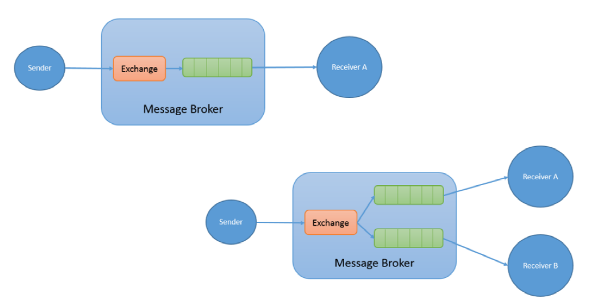

# RabbitMQ
Category: Communications Broker

## TOC
[What](#what)  
[Terminology](#terminology)  
[Why](#why)  
[Diff from Kafka](#diff-from-kafka)  

## What 
RBQ is a message brokering system that implements Advanced Message Queueing Protocol (AMPQ) that standardizes message usage across a distributed system, making all services into producers and/or consumers of messages, with the broker in the middle. 

 ## Terminology

 **Producer** - Anyone who sends a message to RBMQ, only commnicates with exchange
 - The track from the producer to the consumer is considered "end to end"

**Exchange** - The block that receives messages from the producer (created by the producer) that can then communicate with queues
- have different types, and the message distribution depends on these types
- types: fanout, direct, topic, headers, and default
- exchange looks at message routing key when deciding how to route the message

**Binding** - The connection between an exchange and queue, has a binding key
- direct matching is most frequent; if binding key of the binding matches routing key of the message, then the message is routed through this linkage

**Routing key** - Message attribute that is viewed by the exchange to see how the message should be routed

**Consumer** - Receiver of a message from a queue connected to an exchange
- The consumer creates a queue not RabbitMQ

**Queue** - Created funnel of comms to the consumer with routing keys (what message types the queue wants to hear)
- Message can only be heard from queue one msg at a time, and that msg is emptied out of queue once heard
- If queues can't load into the service quickly enough, a system scaled through Kubernetes can create multiple services to handle msgs from the same Queue, based on config values the service is connected with (good practice on a big system to have at least two services live at all times, at least one backup)
- RBMQ does not guarantee message order (not really a FIFO type of Queue)

## Why
 The exchange system regulates communication well, allows for message delivery to be easily scalable (as), and have minimal direct dependence between service. For instance, see following diagram:

 

 - The upper example has the sender sending the message to an exchange that then loads into one queue to receiver A. However, if you wanted to add another receiver for the same message, you would simply have that receiver set up a queue to receive a message from the same exchange, rather than having to touch the sender at all. Then, when the sender would send out a message, both queues would receive the message.
 - The system of one queue to multiple of the same type of service makes autoscaling very easy. 
 - The consumer acknowledgement system also ensures that the consumer gets the message, otherwise the message is then requeued until acknowledgement is received.

## Diff from Kafka: 
- Kafka has message ordering (generally)
- Kafka logs messages (message will be stored perpetually)
- RabbitMQ allows complex messaging priority, which Kafka does not
- Generally Kafka is faster than RabbitMQ
- Kafka better for 'stream processing', great for metrics, activity tracking, event sourcing, data aggregation
- RabbitMQ works better with legacy/older protocols
- RabbitMQ allows more granular control over message sending, whereas Kafka is more batch emphasized 
- RabbitMQ uses a Queue pushing to consumers models, whereas Kafka uses a consumers pulling batches based model 

